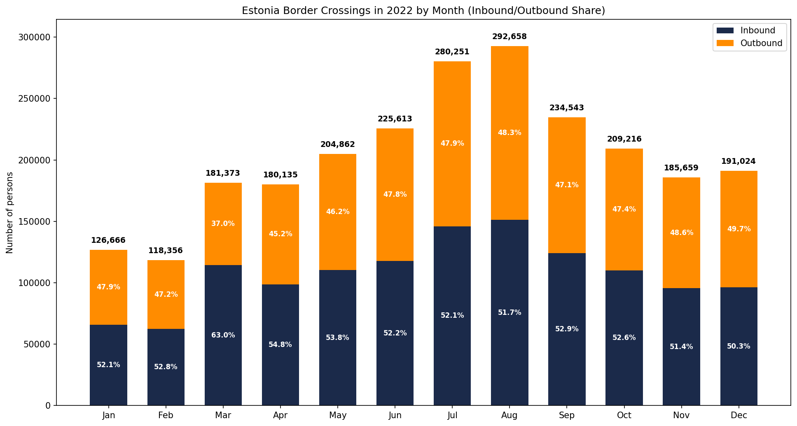
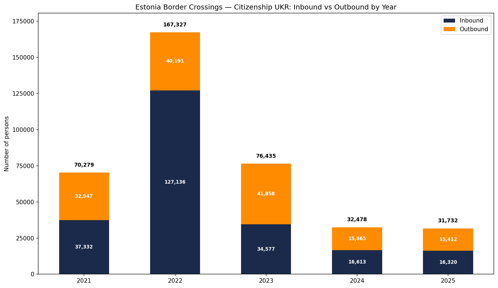
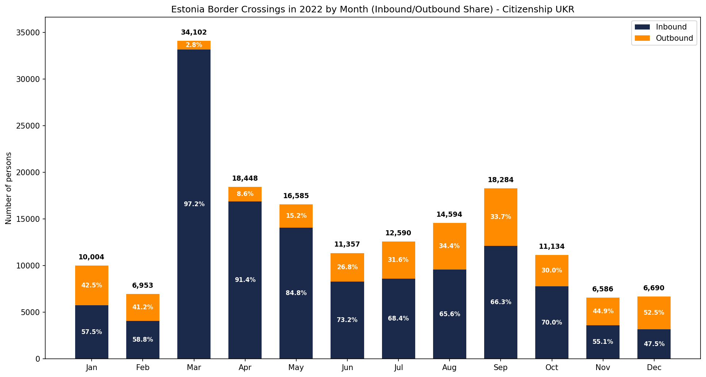
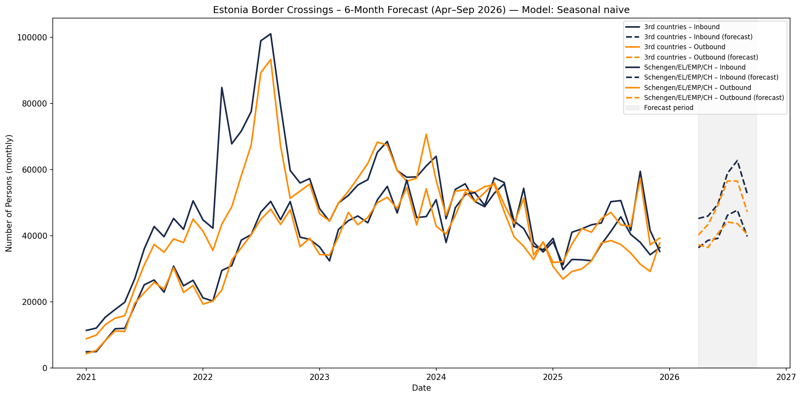
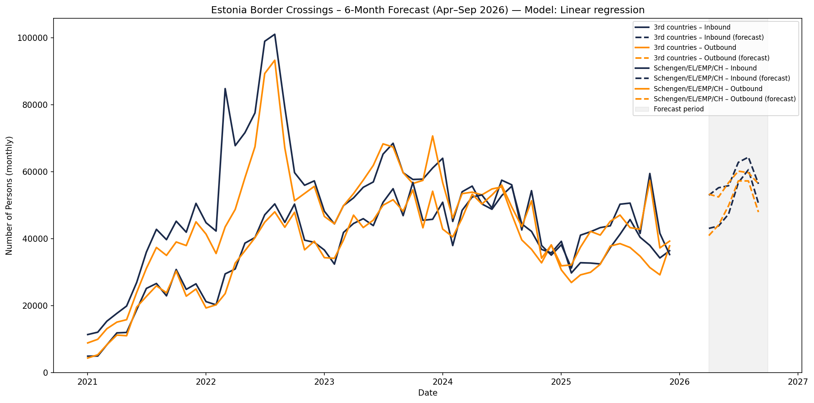
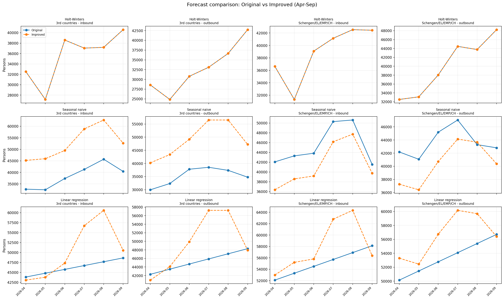

# Estonia Border Crossing Analysis
  
The project is created with Cursor.

## Overview

The project analyses Estonian border crossing data (2021–2025) from the Police and Border Guard Board open data.
It produces an exploration report, a chart of crossings by year and country group (with inbound/outbound stacked), 
and a 6‑month forecast (April–September) using three different models.
Results are summarised in `outputs/forecast_numbers.txt`. 
See `project_overview.md` for a project description.

## Border crossings chart


## Border crossings in 2022



## UKR citizenship: inbound vs outbound by year



## UKR citizenship: inbound vs outbound in 2022



## Forecast: models and outputs

The project produces a 6‑month forecast (April–September of the current year) for monthly border crossings, 
split by country group (Schengen/EL/EMP/CH vs 3rd countries) and direction (inbound vs outbound). 
Three forecasting models are run to compare different methods.

### Models used

1. **Holt-Winters (exponential smoothing)**  
   Additive trend and additive seasonal pattern with a 12‑month period. Parameters are fitted on historical monthly totals.
   A standard method for series with trend and seasonality (no exogenous variables).  
   Chart: `outputs/forecast_holtwinters.png`

2. **Seasonal naive**  
   For each future month, the forecast is the observed value for the same month in the previous year (or the last available same month). Simple baseline that uses only recent seasonality.  
   Chart: `outputs/forecast_seasonal_naive.png`

3. **Linear regression**  
   Ordinary least squares with time (trend) and month (1–12) as predictors: `count ~ time + month`. Captures linear trend and monthly seasonality. If a series has fewer than 24 months, it falls back to the seasonal naive forecast.  
   Chart: `outputs/forecast_linear_regression.png`

### Forecast charts


### Improved forecast charts

The improved pipeline includes walk-forward validation and updated model logic:
- Holt-Winters with fallback initialization
- Seasonal naive using average of all historical same-month values
- Linear regression with month dummy variables






### Forecast comparison chart

This chart compares original and improved forecast outputs side by side for each model,
country group, and direction.




## Setup

```bash
python -m venv .venv
.venv\Scripts\activate   # Windows
pip install -r requirements.txt
```

## Run

```bash
python main.py
```

## Data source

https://www.politsei.ee/et/juhend/politseitoeoega-seotud-avaandmed/piiriuletused
