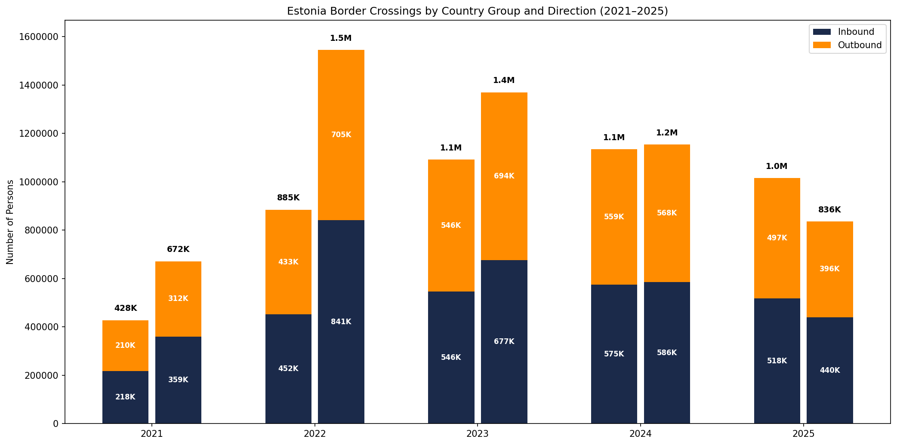
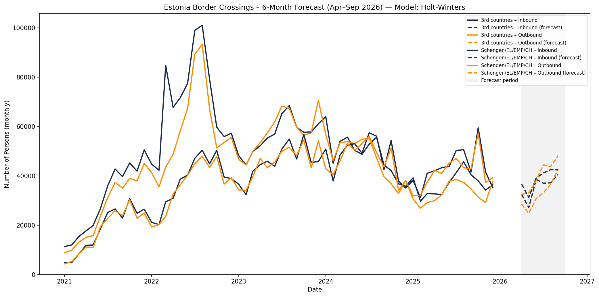
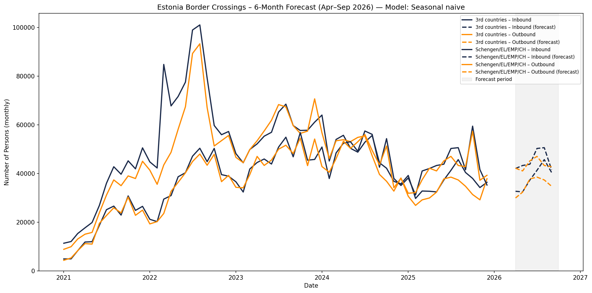
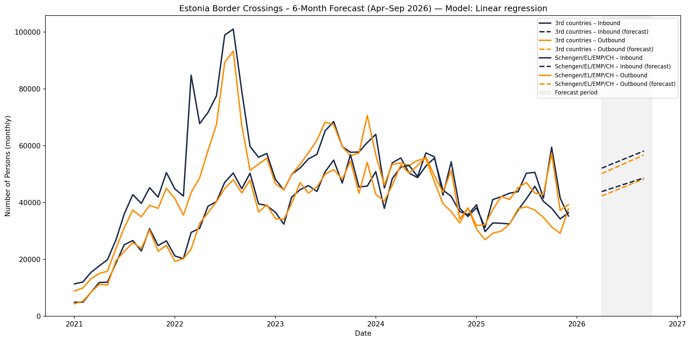

# Estonia Border Crossing Analysis

## Overview

The project analyses Estonian border crossing data (2021–2025) from the Police and Border Guard Board open data.
It produces an exploration report, a chart of crossings by year and country group (with inbound/outbound stacked), and a 6‑month forecast (April–September) using **three different models**. Each model has its own forecast chart (PNG) and all results are summarised in `outputs/forecast_numbers.txt`. All outputs are in `outputs/`. See `project_overview.md` for a file-by-file description.

## Border crossings chart



## Forecast: models and outputs

The project produces a **6‑month forecast** (April–September of the current year) for monthly border crossings, split by **country group** (Schengen/EL/EMP/CH vs 3rd countries) and **direction** (inbound vs outbound). **Three forecasting models** are run so you can compare different methods.

### Models used

1. **Holt-Winters (exponential smoothing)**  
   Additive trend and additive seasonal pattern with a 12‑month period. Parameters are fitted on historical monthly totals. A standard method for series with trend and seasonality (no exogenous variables).  
   Chart: `outputs/forecast_holtwinters.png`

2. **Seasonal naive**  
   For each future month, the forecast is the observed value for the **same month in the previous year** (or the last available same month). Simple baseline that uses only recent seasonality.  
   Chart: `outputs/forecast_seasonal_naive.png`

3. **Linear regression**  
   Ordinary least squares with **time** (trend) and **month** (1–12) as predictors: `count ~ time + month`. Captures linear trend and monthly seasonality. If a series has fewer than 24 months, it falls back to the seasonal naive forecast.  
   Chart: `outputs/forecast_linear_regression.png`

Each chart shows **historical** (solid lines) and **forecast** (dashed lines), with the forecast period shaded. The **model name is shown in the chart title** so you can see which method produced the result.

### Forecast outputs

| Output | Description |
|--------|-------------|
| `outputs/forecast_holtwinters.png` | Chart for Holt-Winters forecast (title: Model: Holt-Winters) |
| `outputs/forecast_seasonal_naive.png` | Chart for seasonal naive forecast (title: Model: Seasonal naive) |
| `outputs/forecast_linear_regression.png` | Chart for linear regression forecast (title: Model: Linear regression) |
| `outputs/forecast_numbers.txt` | Numbers for all three models: monthly forecasts and totals (Inbound, Outbound, Total) per model |

### Forecast charts (one per model)







### Forecast numbers (text file)

Example of the table format in `forecast_numbers.txt` (per model):

| Period   | Country group        | Direction | Count    |
|----------|----------------------|-----------|----------|
| 2026-04  | Schengen/EL/EMP/CH   | inbound   | 36,637   |
| ...      | ...                  | ...       | ...      |

Plus **TOTALS** (April–September, all country groups) for Inbound, Outbound, and Total.

## Setup

```bash
python -m venv .venv
.venv\Scripts\activate   # Windows
pip install -r requirements.txt
```

## Run

```bash
python main.py
```

## Data source

https://www.politsei.ee/et/juhend/politseitoeoega-seotud-avaandmed/piiriuletused
